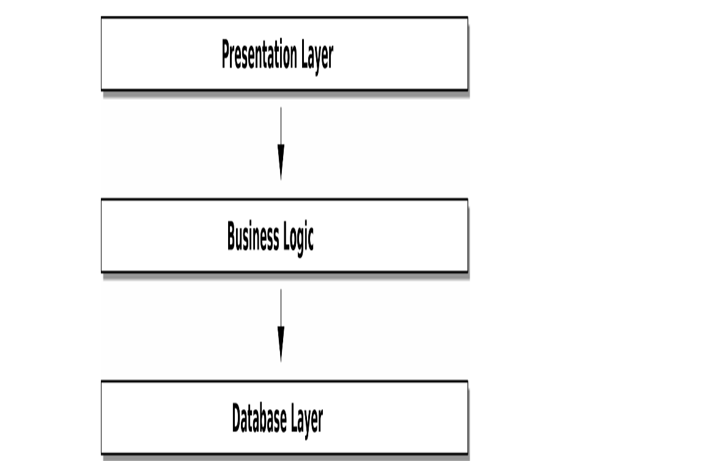

# Introduction

## Encapsulation and Abstractions

- Question: what is encapsulation??
    - the term covers two closely relatted ideas which are simplifying behaviour and hiding data.
    - we encapsulate behaviour by identifying a task that needs to be done in our code and giving that task to a well-defined object or function.

- that function then becomes an abstraction.

Examples: two code snippets

1. searching with urlib

```python
import json
from urllib.request import urlopen
from urllib.parse import urlencode

params = dict(q='Sausage', format='json')
handle = urlopen('http://api.duckduckgo.com' + 'q' + urlencode(param))
raw_text = handle.read().decode('utf8')

parsed = json.loads(raw_text)

results = parsed['RelatedTopics']
for r in results:
    if 'Text' in r:
        print(r['FirstURL'] ' - ' + r['Text'])
```

2. searching with requests

```python
import requests

params = dict(q='Sausage', format='json')
parsed = request.get('http://duckduckgo.com/',
params=params).json()

results = parsed['RelatedTopics']
for r in results:
    if 'Text' in r:
        print(r['FirstURL'] + ' - ' + r['Text'])
```

- from the two code snippets, both do the same thing which is submitting form-encoded values to a URL in order to use a search engine API
- NB: the second snippet is simpler because it operates at a higher level of abstraction

> in object-oriented world, one of the classic characterizations of abstraction and encapsulation is called respnsibility-driven design; think about code in terms of behaviour rather than in terms of data or algorithms. 

- encapsulation and abstraction help hide details and protect the consistency of the data.

**Layering**

- layered architecture is a form of coding technique where code is divided into descrete categories or roles e.g., three-layered architecture:




## The Dependency Inversion Principle

States:

1. high-level modules should not depend on low-level modules. both should depend on abstraction.
2. abstractions should not depend on details. instead, details should depend on abstractions.

The higher modules of a software system are the functions, classes, and packages that deal with real-world concepts.

- basically the business code shouldn't depend on technical details, instead, both should use abstractions. **but why??**
    - gives the freedom to be able to change them independently of each other.