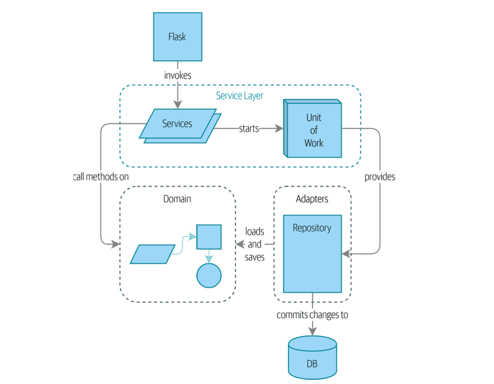

# Domain Modeling

- build object model first then the database schema.

> behaviour should come first and drive the storage requirements.

**Four design patterns**:

1. repository pattern
      - abstraction over the idea of persistent storage
2. service layer pattern
      - clearly define where use case begins and ends
3. unit of work pattern
     - provide atomic operations
4. aggregate pattern
     - enforce the integrity of the data

**What is a Domain Model??**

- the domain model is the mental map that business owners have of their businesses.
    - the domain is the problem we're trying to solve and model is map of the process.

- SKU - short for stock-keeping unit